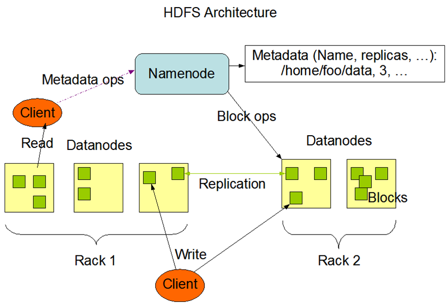
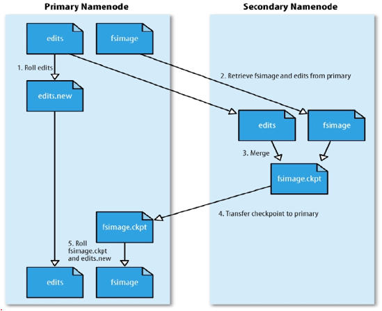
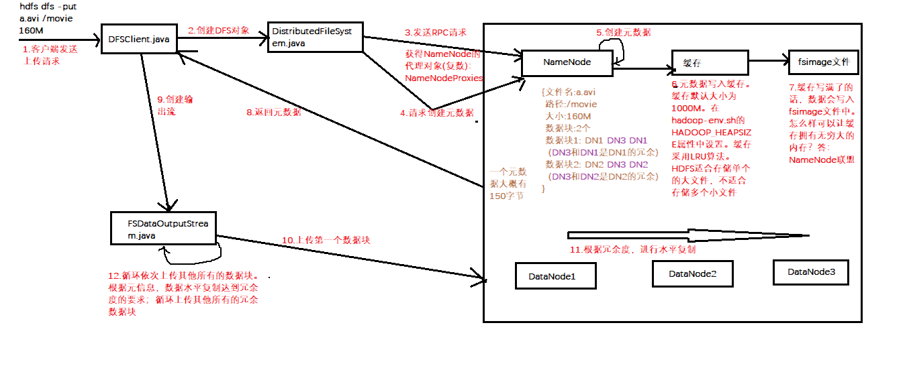
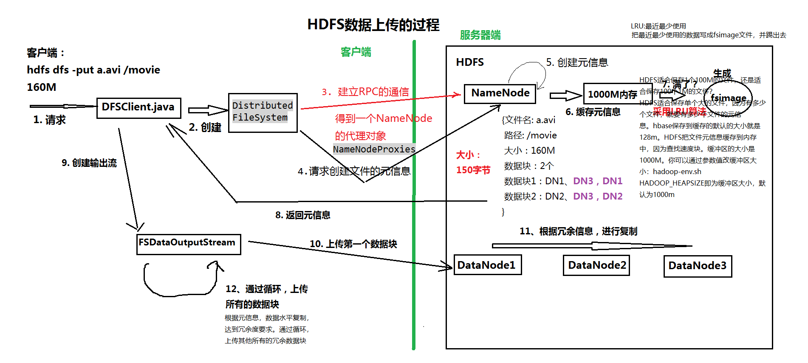
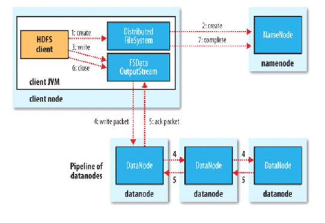
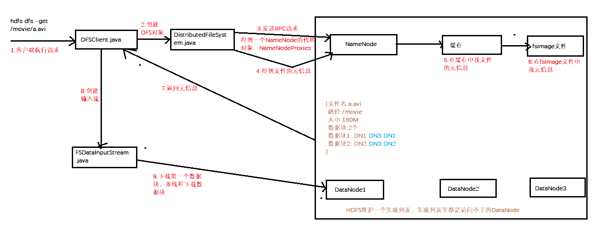
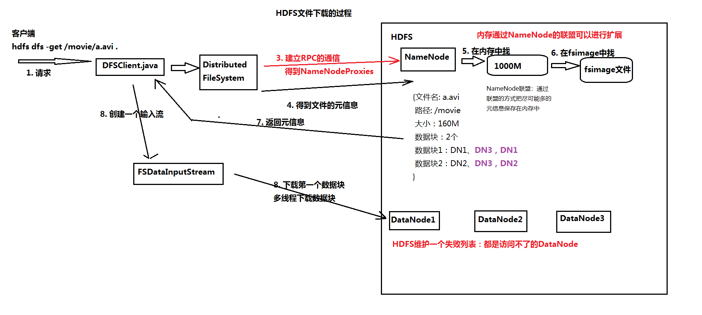

单机处理大数据问题  
需求：有一个非常大的文本文件，里面有很多行，只有两行是一样的，它们出现在未知的位置。需要查找它们。
单机，而且可用的内存很少，只有几十兆  
思路：哈希code ？很有可能会有哈希冲突，但是已经过滤掉了绝大部分了。再对哈希值相同的数据进行比较，即可

<h1>各种版本之间的差异</h1> （第一节课 1小时之后的视频有）
Hadoop项目：  
1.X版本中有的：  
Hadoop Common  
HDFS  
Hadoop MapReduce  
2.X版本中有
YARN
CDH企业现在用的5.X的比较多，因为集成的版本相对比较稳定，如现在集成的Hadoop是2.6
但6.X集成的hadoop就是3.X了。

***
<h1>理论知识点</h1>
<h5>•存储模型</h5>
<h5>•架构设计</h5>
<h5>•角色功能</h5>
<h5>•元数据持久化</h5>
<h5>•安全模式</h5>
<h5>•副本放置策略</h5>
<h5>•读写流程</h5>
<h5>•安全策略</h5>

***
<h2>存储模型</h2>
PPT内容：《02hadoop-hdfs.pptx》
分布式文件系统那么多
为什么hadoop项目中还要开发一个hdfs文件系统？  

存储模型  
文件线性按字节切割成块(block)，具有offset，id  
HDFS会把大的文件散开，可以支持分治。很多计算可以发送到计算节点，移动数据比移动计算快，数据向计算移动。
这是理论，但是实际上是如何分工的？
先举个例子，如果有10个人，找到班里的不同的同学存储数据，存完之后N个月过来取，他们怎么记得自己的数据是存在哪个同学的笔记本里边了呢？
那么就让10个同学的笔记本电脑存储数据，其中一个人的电脑用来记账，负责记录数据是存储在谁的电脑里的  
文件与文件的block大小可以不一样  
一个文件除最后一个block，其他block大小一致  
block的大小依据硬件的I/O特性调整  
block被分散存放在集群的节点中，具有location  
Block具有副本(replication)，没有主从概念，副本不能出现在同一个节点  
副本是满足可靠性和性能的关键  
文件上传可以指定block大小和副本数，上传后只能修改副本数  
一次写入多次读取，不支持修改  
支持追加数据  

<h1>架构设计</h1>
HDFS是一个主从(Master/Slaves)架构  
物理架构设计中，HDFS是主从架构。主从、主备。主从，master-slaves，两个人都是工作，而且有通信，互相协作。主备，高可用，一个工作，一个备用。  
由一个NameNode和一些DataNode组成   
nn就是主，dn就是从  
面向文件包含：文件数据(data)和文件元数据(metadata)
文件：声音视频或者其他的文件
win：文件属性
linux或者其他：元数据
NameNode负责存储和管理文件元数据，并维护了一个层次型的文件目录树
win:盘符
linux:目录树
hdfs:目录树，且不是物理操作的目录树
DataNode负责存储文件数据(block块)，并提供block的读写
dn，存储数据。
DataNode与NameNode维持心跳，并汇报自己持有的block信息
Client和NameNode交互文件元数据和DataNode交互文件block数据
client和nn和dn交互不同的东西
最主要的就是nn,dn,client
linux:分区
win:盘符
win
软件 必须从G盘加载一个文件 conf xml
linux
/a /b /c /d /e /f /g
mount /g -> dist:G分区  /b->dist:B分区
软件 必须从/g读取文件，如果没有/g, 可以创建/g，且可以挂在任何一个分区上（有可能是g分区也有可能不是g分区)，但win如果没有g盘符，就会出错。
linux相对于win的好处：软件具备了移动性。程序具备移动性
hdfs也维护了目录树结构，和linux一样，虚拟目录树结构。物理磁盘像win。
目录树对硬件分区做了解耦。
下图为hdfs架构图

<h2>角色功能</h2>
<h4>NameNode</h4>  
完全基于内存存储文件元数据、目录结构、文件block的映射  
需要持久化方案保证数据可靠性  
提供副本放置策略  

<h4>DataNode</h4>  

基于本地磁盘存储block(文件的形式)  
并保存block的校验和数据保证block的可靠性  
校验和：哈希，做文件的校验用的。DN存两个东西：1）数据块本身；2）校验和的那笔数据
与NameNode保持心跳，汇报block列表状态  

记住：角色即进程
NN即一个JVM，内部维护一个目录树结构
集群里有DN。DN描述的是集群的数量。
客户端和NN交互元数据。
NN：path(唯一，这是目录树文件结构的特征)
副本数，副本的位置。

NN是唯一的主
阿里建议集群不要超过5000台
NN完全基于内存存储元数据。（不是基于磁盘）
内存寻址速度是磁盘的10W倍
NN的内存持久化方案和REDIS的内存持久化方案不同

客户端把文件给DN，由DN来存储文件。所以其实文件不是由hdfs来存的，HDFS就是管理映射，就是来了数据，存到哪，做个记账。

<h2>元数据持久化</h2>

任何对文件系统元数据产生修改的操作，Namenode都会使用一种称为EditLog的事务日志记录下来

日志是记录实时发生的CRUD操作，如：  
mkdir /abc  
如果NN挂了，断电了，读取日志里的指令，恢复内存里存储的元数据信息  
日志的优缺点：优点：实时、日志的完整性比较好；缺点：恢复慢，空间占用大。比如说，NN内存是4个G，
NN运行了十年。十年后断电了。请问日志文件多大？超级大。日志这么大，恢复的时候内存会不会溢出？内存不会溢出。
除了日志，还有另外一种方法：快照(dump, db)。间隔发生，内存全量数据基于某一个时间点做的像磁盘的溢写。（如每小时/每天/10分钟等）
和IO挂钩。  
恢复速度快过日志。  
HDFS中日志和快照都使用了。HDFS用了（最近时点）Fsimage 和 增量的log。  
序列化。

使用FsImage存储内存所有的元数据状态  
使用本地磁盘保存EditLog和FsImage  
EditLog具有完整性，数据丢失少，但恢复速度慢，并有体积膨胀风险  
FsImage具有恢复速度快，体积与内存数据相当，但不能实时保存，数据丢失多  
NameNode使用了FsImage+EditLog整合的方案：  
滚动将增量的EditLog更新到FsImage，以保证更近时点的FsImage和更小的EditLog体积  

那么，怎么实现 fsimage + log 的方案呢？
fsimage是怎么10点更新的？  
1、要么NN，8点溢写一次，9点溢写一次（会有IO问题）  
2、当NN第一次开机的时候，只写一次fsimage，假设8点的。到9点的时候，有一个editslog，记录8点-9点的日志。只需要将8点-9点的日志记录更新到8点的fsimages中。fsimage的数据，就变成了9点。  
寻求另外一套机器做合并的事情。所以就出了一个东西，SecondaryNameNode来做合并
editslog和fsimage是怎么产生的？
在HDFS，我们搭建时，我们会有一个操作，格式化分布式文件系统。格式化的时候
会产生一个空的fsimage。当NN启动的时候，必然会从磁盘中读取fsimage和editslog。这时候内存中就变成了关机前完整的数据或者空的fsimage。

<h2>安全模式</h2>

HDFS搭建时会格式化，格式化操作会产生一个空的FsImage  
当Namenode启动时，它从硬盘中读取Editlog和FsImage  
将所有Editlog中的事务作用在内存中的FsImage上  
并将这个新版本的FsImage从内存中保存到本地磁盘上  
然后删除旧的Editlog，因为这个旧的Editlog的事务都已经作用在FsImage上了  

Namenode启动后会进入一个称为安全模式的特殊状态。  
NN 存元数据：文件属性  /  每个块存在哪个DN上。
在持久化的时候，文件属性会持久化，但是每个块不会持久化  
在恢复的时候NN会丢失块的位置信息。
此时客户端要下载就下载不下来了。为什么fsimage要这么做？
因为你已经从单机时代进入了分布式时代，分布式时代最重要的是数据一致性。所以宁可不存，宁可等一段时间，也要保证数据一致性。
如果曾经持久化过，假设启动的时候某一台启动不起来，挂掉了，这时候返回客户端就数据不一致了。所以宁可不存
等一个时间。前面说了DN和NN建立心跳，汇报块的信息。这个过程叫安全模式。

处于安全模式的Namenode是不会进行数据块的复制的。也不能进行CRUD操作  
Namenode从所有的 Datanode接收心跳信号和块状态报告。    
每当Namenode检测确认某个数据块的副本数目达到这个最小值，那么该数据块就会被认为是副本安全(safely replicated)的。  
在一定百分比（这个参数可配置）的数据块被Namenode检测确认是安全之后（加上一个额外的30秒等待时间），Namenode将退出安全模式状态。  
接下来它会确定还有哪些数据块的副本没有达到指定数目，并将这些数据块复制到其他Datanode上。  

合并是怎么做的呢？
<h3>HDFS中的SNN</h3>
SecondaryNameNode（SNN）  
在非Ha模式下，SNN一般是独立的节点，周期完成对NN的EditLog向FsImage合并，减少EditLog大小，减少NN启动时间  
根据配置文件设置的时间间隔fs.checkpoint.period  默认3600秒  
根据配置文件设置edits log大小 fs.checkpoint.size 规定edits文件的最大值默认是64MB  
SNN和版本没关系，只和HA有关系。只有在非HA模式下才会有SNN。  

<h2>Block的副本放置策略</h2>
第一个副本：放置在上传文件的DN；如果是集群外提交，则随机挑选一台磁盘不太满，CPU不太忙的节点。  
第二个副本：放置在于第一个副本不同的 机架的节点上。  
第三个副本：与第二个副本相同机架的节点。  
更多副本：随机节点。  

<h2>HDFS写/上传流程</h2>

流水线也是一种并行的变种，副本的数量是透明的，这种传输效率极高
pipeline传输，Node2传完之后，Node2向Node3传输，DN在和NN做心跳的时候向NN做汇报，我已经传完了多少。
NN只信真实存活的DN汇报的记录。NN会记录，是3个副本向我汇报的，还是只汇报了两个。当NN发现，只有两个汇报，
副本数不足，NN内部会触发一个策略，让其中一个DN再复制出一块。客户端代码量不复杂，只需要一股脑的传输数据就行，HDFS策略会自动屏蔽这个问题。

<h2>HDFS的读/下载流程</h2>

